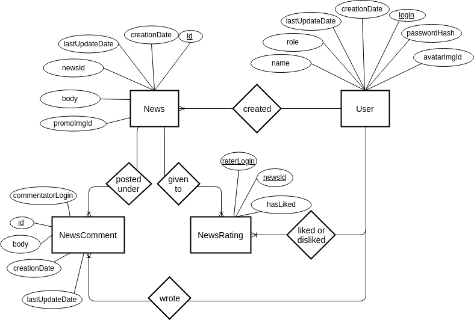
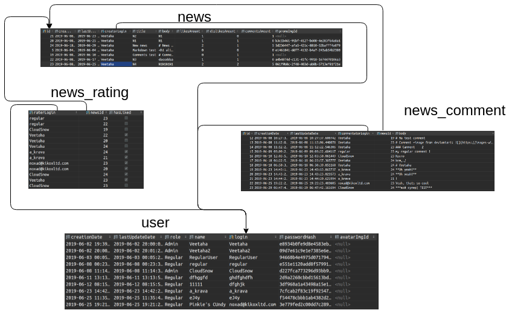

# Lab 1. Getting started with basic PostrgeSQL functionality

## Business field

Website devoted to publishing and discussing computer game news.

## Graphical ER model

## Database relations and tables

## Data description

You can find ojbects fields description [here at live GraphQL playground](https://times-are-changing.herokuapp.com/gql). Beware that server may be idle (since it
is hosted for free) and it needs some time to get up and running.
