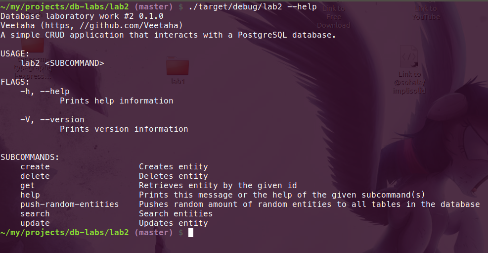
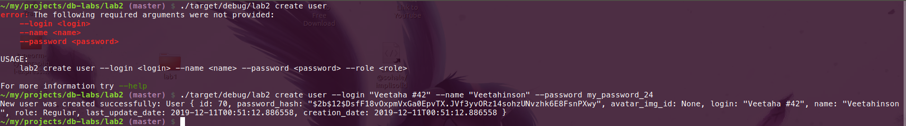
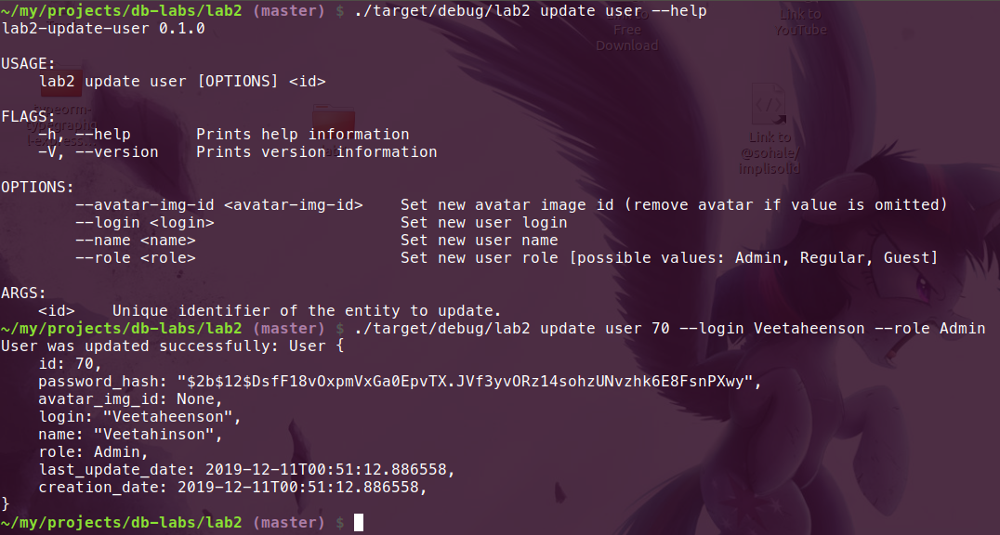
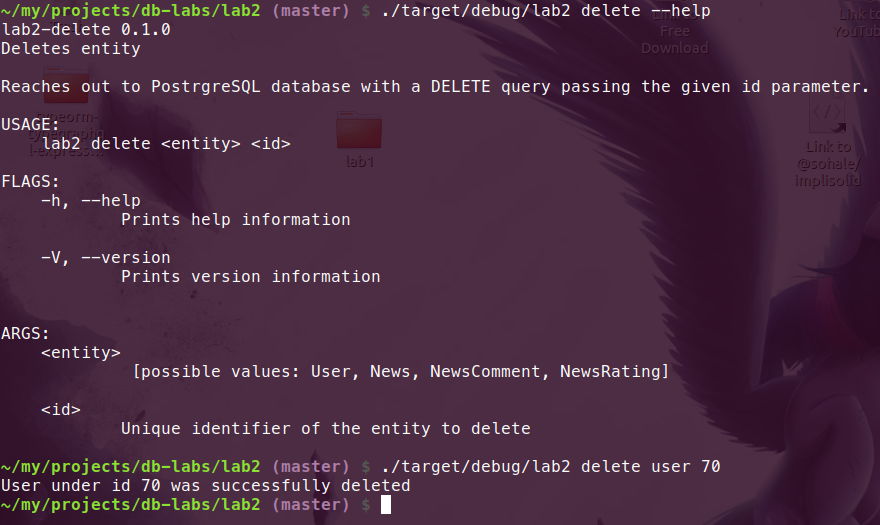
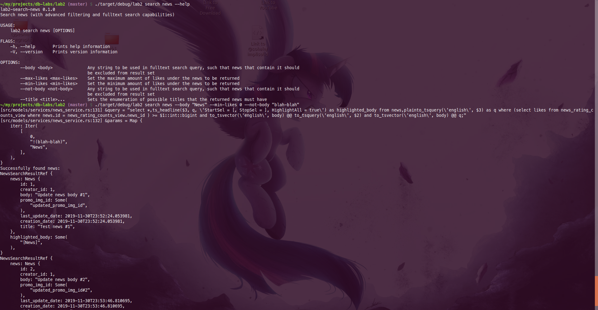
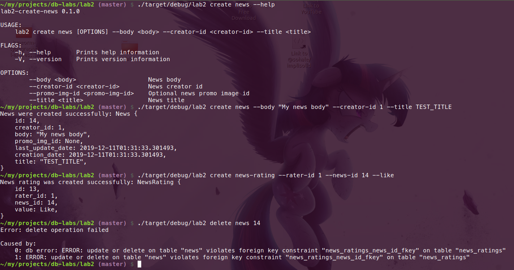

# lab2



## Prerequisites

* [Rust toolchain](https://www.rust-lang.org/learn/get-started)
* libpq

## Bootstrap (Linux)

```bash
# Install rustup
curl --proto '=https' --tlsv1.2 -sSf https://sh.rustup.rs | sh
# Add .cargo/bin to .bash_profile
echo 'export PATH="${HOME}/.cargo/bin:${PATH}"' >> ~/.bash_profile
# Update $PATH variable
source ~/.bash_profile
# Install libpq
sudo apt update
sudo apt install libpq-dev
# Install diesel_cli
cargo install diesel_cli --no-default-features --features postgres
```

## Documentation

[Task (pdf)](docs/task.pdf)

## Task number 6

| Search by attributes | Fulltext search |
|---------------------|----------------------|
| number range, value set | the word doesn't occur, the word is included |

### Normalized database model


| Relation | Attribute | Data type |
|----------|-----------|-----------|
| user | `id` - unique identifier<br>`login` - user login<br>`creationDate` - date when this account was created<br>`lastUpdateDate` - Date when this account was updated last time<br>`role` - defines user access level<br>`name` - user name to refer to him/her<br>`avatarImgId` - avatar picture url, or null of was not set |Int<br>String<br>Date<br>Date<br>Enum<br>String<br> String |
news | `id` - unique identifier<br>`creationDate` - date when this news was created<br>`lastUpdateDate` - date when this news was updated last time<br>`creatorLogin` - login of the user that created this news.<br>`title` - human-readable sentence that laconically describes this news.<br>`body` - news main body markdown text, it may be vulnerable XSS attacks, be sure to sanitize it on the client side after having converted it to HTML.<br>`promoImgId` - id image to display as the.| Int<br>Date<br>Date<br>String<br>String<br>String |
news_comment |`id` - unique identifier<br>`creationDate` - date when this comment was created<br>`lastUpdateDate` - date when this comment was updated<br>`commentatorLogin` - login of the user that cread the comment<br>`newsId` - id of the news that this comment was attached to<br>`body` - text body of the comment| Int<br>Date<br>Date<br>String<br>Int<br>String<body> |
news_rating | `id` - unique identifier<br> `raterLogin` - login of the user that rated the news.<br>`newsId` - id of the news that the user rated.<br>`hasLiked` - defines whether the user liked the news or not. | Int<br>String<br>Int<br>hasLiked |

### SQL
```sql
create type role as enum (
    'Regular',
    'Admin',
    'Guest'
);

create table if not exists users (
    id serial primary key,

    password_hash text not null,
    avatar_img_id text,
    login text not null unique,
    name  text not null,
    role  role not null,
    last_update_date timestamp not null default now(),
    creation_date    timestamp not null default now()
);

create table if not exists news (
    id serial primary key,
    creator_id integer not null references users(id) on delete cascade,

    body text not null,
    promo_img_id text,
    last_update_date timestamp not null default now(),
    creation_date    timestamp not null default now()
);

alter type role rename value 'Admin' to 'admin';
alter type role rename value 'Regular' to 'regular';
alter type role rename value 'Guest' to 'guest';

create table if not exists news_comments (
    id serial primary key,
    commentator_id integer not null references users(id),
    news_id integer not null references news(id),

    body text not null,
    creation_date timestamp not null default now(),
    last_update_date timestamp not null default now()
);

alter table news_ratings add constraint unique_news_and_rater_id unique (news_id, rater_id);
alter table news add column title text not null default '';
alter table news alter column title drop default;

alter type role rename value 'admin' to 'Admin';
alter type role rename value 'regular' to 'Regular';
alter type role rename value 'guest' to 'Guest';
alter type role rename to UserRole;

create index news_body_tsvector_idx on news using gin(to_tsvector('english', body));

create view news_rating_counts_view as
select
    news_id,
    count(case when value = 'like'    then 1 end) as likes,
    count(case when value = 'dislike' then 1 end) as dislikes
from news_ratings
group by news_id;

create or replace function create_random_string(int) returns text as $$
    select array_to_string(
        array(
            select substring(
                '23456789abcdefghjkmnpqrstuvwxyz'
                from floor(random() * 31)::int + 1 for 1
            )
            from generate_series(1, $1)
        ),
        ''
    );
$$
language sql;
```
### Code excerpts with creation, redaction and deletion of items in database and the outcome of running them.

```rust
use crate::database::PgPlaceholdersSeq;

use anyhow::{Result, Context, bail};
use super::{EntityService, CreatableEntityService, ColDataVec, GetTableName, GetPgClient};

pub trait Create: CreatableEntityService + EntityService {
    fn create(&self, new: Self::EntityNew) -> Result<Self::Entity>;
}

impl<T> Create for T
where
    Self: CreatableEntityService + EntityService + GetTableName + GetPgClient,
    Self::EntityNew: Into<ColDataVec>
{
    fn create(&self, new: Self::EntityNew) -> Result<Self::Entity> {
        let col_datas: ColDataVec = new.into();
        
        if col_datas.is_empty() {
            bail!("Can't create entity since its column data is empty.");
        }

        let query = format!(
            "insert into {table} ({cols}) values ({values}) returning *;",
            table = self.get_table_name(),
            cols = col_datas.col.join(","),
            values = PgPlaceholdersSeq::new(1..=col_datas.len())
        );

        use fallible_iterator::FallibleIterator;

        // create an explicit variable to workaround temporaries drop order error
        let entity = Self::Entity::from(self
            .get_pg_client()
            .query_raw(&query[..], col_datas.val.iter().map(AsRef::as_ref))
            .context("Failed to create entity")?
            .next()
            .context("Failed to get the record returned by insert query")?
            .context("Insert record iterator appeared to be empty")?
        );
        Ok(entity)
    }
}

// UPDATE ------

use anyhow::{Result, bail, Context};
use super::{
    GetTableName,
    GetPgClient,
    EntityService,
    GetId,
    UpdatableEntityService,
    ColDataVec
};


pub trait UpdateById: EntityService + UpdatableEntityService {
    fn update_by_id(&self, entity_upd: Self::EntityUpd) -> Result<Self::Entity>;
}


impl<T> UpdateById for T 
where
    Self: EntityService + UpdatableEntityService + GetTableName + GetPgClient,
    Self::EntityUpd: GetId + Into<ColDataVec>
{

    fn update_by_id(&self, upd: Self::EntityUpd) -> Result<Self::Entity> {
        let id = upd.get_id();
        let col_datas: ColDataVec = upd.into();
        
        if col_datas.is_empty() {
            bail!("Entity update data contains no columns to update");
        }

        let query = format!(
            "update {table} set {assignments} where id = {id} returning *;",
            table = self.get_table_name(),
            id = id,
            assignments = col_datas.col.iter()
                .enumerate()
                .map(|(i, col_name)| format!("{} = ${}", col_name, i + 1))
                .collect::<Vec<_>>()
                .join(",")
        );

        use fallible_iterator::FallibleIterator;

        // create an explicit variable to workaround temporaries drop order error
        let entity = Self::Entity::from(self
            .get_pg_client()
            .query_raw(&query[..], col_datas.val.iter().map(AsRef::as_ref))
            .context("Failed to update entity by id")?
            .next()
            .context("Failed to get the record returned by update query")?
            .context("Update record iterator appeared to be empty")?
        );
        Ok(entity)
    }
}

// DELETE ----

use anyhow::{Result, Context};

use super::{GetTableName, GetPgClient};

pub trait DeleteById {
    fn delete_by_id(&self, id: i32) -> Result<bool>;
}

impl<T> DeleteById for T
where
    Self: GetTableName + GetPgClient
{
    fn delete_by_id(&self, id: i32) -> Result<bool> {
        self.get_pg_client()
            .execute(
                &*format!("delete from {} where id = $1;", self.get_table_name()),
                &[&id]
            )
            .context("delete operation failed")
            .map(|rows_affected| rows_affected > 0)
    }
}
```

### Creating data and its outcome

### Updating data and its outcome

### Deleting data and its outcome

### Searching data and its outcome


### Static and dynamic search code excerpts

```rust
use soa_derive::StructOfArray;
use anyhow::{Result, Context};
use fallible_iterator::{FromFallibleIterator, IntoFallibleIterator, FallibleIterator};
use crate::{
    models::{
        entities::News,
        traits
    },
    cli::{ NewsNew, NewsUpdate, NewsSearch },
    database::PgConnPool
};

pub struct NewsService {
    pg_conn_pool: PgConnPool
}

#[derive(Debug, StructOfArray)]
#[soa_derive = "Debug"]
pub struct NewsSearchResult {
    news: News,
    highlighted_body: Option<String>
}
impl From<pg::Row> for NewsSearchResult {
    fn from(row: pg::Row) -> Self { Self {
        highlighted_body: row.get("highlighted_body"),
        news: News::from(row)
    } }
}

impl FromFallibleIterator<pg::Row> for NewsSearchResultVec {
    
    fn from_fallible_iter<I>(rows_iterator: I) -> Result<Self, I::Error>
    where
        I: IntoFallibleIterator<Item = pg::Row> 
    {
        let mut rows_iterator = rows_iterator.into_fallible_iter();

        let mut result = NewsSearchResultVec::new();
        
        while let Some(row) = rows_iterator.next()? {
            result.push(NewsSearchResult::from(row));
        }

        Ok(result)
    }
}


impl NewsService {
    pub fn new(pg_conn_pool: PgConnPool) -> Self {
        Self { pg_conn_pool }
    }

    pub fn search(&self, search: &NewsSearch) -> Result<NewsSearchResultVec> {
        use traits::*;
        use crate::database::SqlParams;

        let mut select_clauses = vec!["*".to_owned()];
        let mut where_clauses  = Vec::new();
        let mut from_clauses   = vec![self.get_table_name().to_owned()];

        let mut params = SqlParams::new();

        let mut add_likes_bound = |operator, rhs| where_clauses.push(format!(
            "(\
                select likes from news_rating_counts_view \
                where {news_table}.id = news_rating_counts_view.news_id \
             ) {operator} ${max_likes}::int::bigint",
            news_table = self.get_table_name(),
            operator = operator,
            max_likes = params.push(rhs)
        ));

        if let Some(max_likes) = &search.max_likes {
            add_likes_bound("<=", max_likes);
        }
        if let Some(min_likes) = &search.min_likes {
            add_likes_bound(">=", min_likes);
        }
        
        if let Some(titles) = &search.title {
            use crate::database::PgPlaceholdersSeq;
            
            where_clauses.push(format!("title in ({})", PgPlaceholdersSeq::new(
                params.len()..=(params.len() + titles.len())
            )));
            // this map is necessary in because it maps regular &String
            // to fat references (polymorphic ones that contain vtable pointer for ToSql)
            // &String: (ptr) -> &dyn ToSql: (ptr, vtable)
            params.extend(titles.iter().map(|t| t as _));
        }
        let not_body_val;
        if let Some(not_body) = &search.not_body {
            not_body_val = format!("!({})", not_body
                .split_whitespace()
                .collect::<Vec<_>>()
                .join(" | ")
            );

            where_clauses.push(format!(
                "to_tsvector('english', body) @@ to_tsquery('english', ${})",
                params.push(&not_body_val)
            ));
        }

        if let Some(body) = &search.body {
            let body_param = params.push(body);
            select_clauses.push(format!(
                "ts_headline(${}, q, 'StartSel = [, \
                StopSel = ], HighlightAll = true') as highlighted_body", 
                body_param
            ));
            from_clauses.push(format!("plainto_tsquery('english', ${}) as q", body_param));
            where_clauses.push("to_tsvector('english', body) @@ q".to_owned());
        }

        let mut client = self.get_pg_client();

        let query = format!(
            "select {select_clause} from {from_clause}{where}{where_clause};",
            select_clause = select_clauses.join(","),
            from_clause   = from_clauses.join(","),
            where         = if where_clauses.is_empty() { " " } else { " where " },
            where_clause  = where_clauses.join(" and ")
        );

        let params = params.as_slice()
            .into_iter()
            .map(std::ops::Deref::deref);

        dbg!(&query);
        dbg!(&params);

        // IntoIterator
        let res = client.query_raw(&*query, params)?
            .collect()
            .context("News service failed to search news.");

        res
    }

}

impl traits::EntityService          for NewsService { type Entity = News; }
impl traits::UpdatableEntityService for NewsService { type EntityUpd = NewsUpdate; }
impl traits::CreatableEntityService for NewsService { type EntityNew = NewsNew; }
impl traits::GetTableName  for NewsService { fn get_table_name(&self) -> &str { "news" } }
impl traits::GetPgConnPool for NewsService {
    fn get_pg_conn_pool(&self) -> PgConnPool {
        // Clone operation is fast and efficient since it is just an atomic reference counter
        // under the hood, thus to make it explicit calling `clone()`
        // not as a metod but via free function call syntax to make it explicit
        PgConnPool::clone(&self.pg_conn_pool)
    }
}
impl traits::GetPgClientFromPoolInfallible for NewsService {}
```
### Model module code excerpts according to MVC template

```rust
use chrono::NaiveDateTime;
use pg::row::Row as PgRow;

#[derive(Debug)]
pub struct News {
    id: i32,
    creator_id: i32,
    body: String,
    promo_img_id: Option<String>,
    last_update_date: NaiveDateTime,
    creation_date: NaiveDateTime,
    title: String
}

impl From<PgRow> for News {
    fn from(row: PgRow) -> Self { Self {
        id:               row.get("id"),
        creator_id:       row.get("creator_id"),
        body:             row.get("body"),
        promo_img_id:     row.get("promo_img_id"),
        last_update_date: row.get("last_update_date"),
        creation_date:    row.get("creation_date"),
        title:            row.get("title"),
    }}
}
```
### Deleting parent item whilst a child table has references to it and displaing the error message


