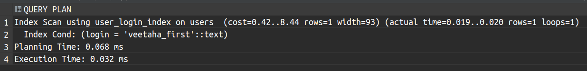
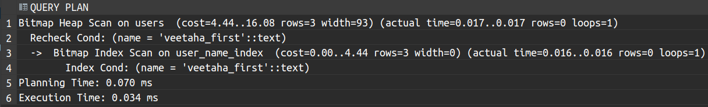
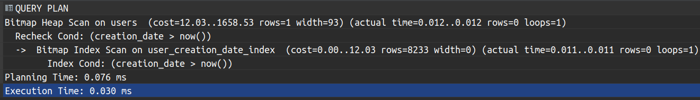
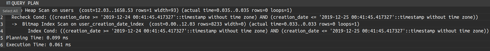
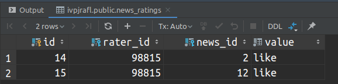

# lab3


## Prerequisites

* [Rust toolchain](https://www.rust-lang.org/learn/get-started)
* libpq

## Bootstrap (Linux)

```bash
# Install rustup
curl --proto '=https' --tlsv1.2 -sSf https://sh.rustup.rs | sh
# Add .cargo/bin to .bash_profile
echo 'export PATH="${HOME}/.cargo/bin:${PATH}"' >> ~/.bash_profile
# Update $PATH variable
source ~/.bash_profile
# Install libpq
sudo apt update
sudo apt install libpq-dev
# Install diesel_cli
cargo install diesel_cli --no-default-features --features postgres
```

## Documentation

[Task (pdf)](docs/task.pdf)

## Task number 6

| Index type | Trigger conditions |
|---------------------|----------------------|
| BTree, BRIN | after update, insert |

### Normalized database model


| Relation | Attribute | Data type |
|----------|-----------|-----------|
| user | `id` - unique identifier<br>`login` - user login<br>`creationDate` - date when this account was created<br>`lastUpdateDate` - Date when this account was updated last time<br>`role` - defines user access level<br>`name` - user name to refer to him/her<br>`avatarImgId` - avatar picture url, or null of was not set |Int<br>String<br>Date<br>Date<br>Enum<br>String<br> String |
news | `id` - unique identifier<br>`creationDate` - date when this news was created<br>`lastUpdateDate` - date when this news was updated last time<br>`creatorLogin` - login of the user that created this news.<br>`title` - human-readable sentence that laconically describes this news.<br>`body` - news main body markdown text, it may be vulnerable XSS attacks, be sure to sanitize it on the client side after having converted it to HTML.<br>`promoImgId` - id image to display as the.| Int<br>Date<br>Date<br>String<br>String<br>String |
news_comment |`id` - unique identifier<br>`creationDate` - date when this comment was created<br>`lastUpdateDate` - date when this comment was updated<br>`commentatorLogin` - login of the user that cread the comment<br>`newsId` - id of the news that this comment was attached to<br>`body` - text body of the comment| Int<br>Date<br>Date<br>String<br>Int<br>String<body> |
news_rating | `id` - unique identifier<br> `raterLogin` - login of the user that rated the news.<br>`newsId` - id of the news that the user rated.<br>`hasLiked` - defines whether the user liked the news or not. | Int<br>String<br>Int<br>hasLiked |

### Updated code that uses ORM.

```rust
// diesel dsl file
// schema.rs

table! {
    news (id) {
        id -> Int4,
        creator_id -> Int4,
        body -> Text,
        promo_img_id -> Nullable<Text>,
        last_update_date -> Timestamp,
        creation_date -> Timestamp,
        title -> Text,
    }
}

table! {
    news_comments (id) {
        id -> Int4,
        commentator_id -> Int4,
        news_id -> Int4,
        body -> Text,
        creation_date -> Timestamp,
        last_update_date -> Timestamp,
    }
}

table! {
    news_ratings (id) {
        id -> Int4,
        rater_id -> Int4,
        news_id -> Int4,
        value -> Ratingvalue,
    }
}

table! {
    users (id) {
        id -> Int4,
        password_hash -> Text,
        avatar_img_id -> Nullable<Text>,
        login -> Text,
        name -> Text,
        role -> Userrole,
        last_update_date -> Timestamp,
        creation_date -> Timestamp,
    }
}

joinable!(news -> users (creator_id));
joinable!(news_comments -> news (news_id));
joinable!(news_comments -> users (commentator_id));
joinable!(news_ratings -> news (news_id));
joinable!(news_ratings -> users (rater_id));

allow_tables_to_appear_in_same_query!(
    news,
    news_comments,
    news_ratings,
    users,
);
// entities/user.rs

#[derive(Debug, Queryable, Identifiable, AsChangeset)]
pub struct User {
    pub id: i32,
    pub password_hash: String,
    pub avatar_img_id: Option<String>,
    pub login: String,
    pub name: String,
    pub role: UserRole,
    pub last_update_date: NaiveDateTime,
    pub creation_date: NaiveDateTime
}

#[derive(Debug, AsChangeset, Identifiable)]
#[table_name="users"]
pub struct UserUpdate {
    pub id: i32,
    pub avatar_img_id: Option<Option<String>>,
    pub login: Option<String>,
    pub name: Option<String>,
    pub role: Option<UserRole>
}


// user_service.rs

use anyhow::{Result, Context};
use diesel::prelude::*;
use crate::{models::entities::{self, User}, cli, database::PgConnPool};

pub struct UserService {
    pg_conn_pool: PgConnPool
}

use crate::models::schema::users::dsl as DieselUserDsl;

impl UserService {

    pub fn new(pg_conn_pool: PgConnPool) -> Self {
        Self { pg_conn_pool }
    }

    pub fn create(&self, user_new: cli::UserNew) -> Result<User> {
        use DieselUserDsl::*;

        diesel::insert_into(users)
            .values(&user_new)
            .get_result(&*self.pg_conn_pool.get().unwrap())
            .context("Failed to create user")
    }

    pub fn get_by_id(&self, target_id: i32) -> Result<User> {
        use DieselUserDsl::*;

        users.filter(id.eq(target_id))
            .get_result(&*self.pg_conn_pool.get().unwrap())
            .context("Failed to get user by id")
    }

    pub fn update_by_id(&self, upd: cli::UserUpdate) -> Result<User> {
        entities::UserUpdate::from(upd)
            .save_changes(&*self.pg_conn_pool.get().unwrap())
            .context("Failed to update user by id")
    }

    pub fn delete_by_id(&self, target_id: i32) -> Result<bool> {
        use DieselUserDsl::*;

        diesel::delete(users).filter(id.eq(target_id))
            .execute(&*self.pg_conn_pool.get().unwrap())
            .map(|rows_affected| rows_affected > 0)
            .context("Failed to delte user by id")
    }
}
```

### Index creation and query analisys

```sql
create index creation_date_index on users using brin (creation_date);
create index login_index on users using btree (login);
create index login_index on users using btree (name);
```

#### SQL queries

```sql
select * from users where login = 'veetaha_first';
``` 


```sql
select * from users where name = 'veetaha_first';
```
```sql
select * from users where name like 'veetaha%';
```


```sql
select * from users where creation_date > now();
```

```sql
select * from users where creation_date between '2019-12-24 00:41:45.417327' and '2019-12-25 00:41:45.417327';
```


### Triggers

#### Creation

```sql
create function my_users_trigger() returns trigger as $$
    declare
        news_name text;
        cur_name news_ratings.news_id%TYPE;
    begin
        raise notice 'New role %', new.role;
        if new.role = 'guest'::userrole then
            raise 'Failed to set "guest" role for %. This role is prohibited for real users.', new.name;
        else
            raise notice 'User % now likes everything!', new.name;
            update news_ratings set value = 'like' where rater_id = new.id;
        end if;
        for news_name in
            select title from news
            join news_ratings on new.id = rater_id and news_id = news.id
        loop

            raise notice 'User % now likes %', new.name, news_name;
        end loop;
        return new;
    exception
            when no_data_found then
            when too_many_rows then
                raise 'Omg, Danila ty sho!';
    end;
$$ language plpgsql;

create trigger my_trigger_on_users after update or insert on users for each row execute procedure my_users_trigger();
```
#### Examples
```sql
insert into users
values (default, 'asdsa', null, 'ma_login6', 'ma_name', 'guest', now(), now());
```
```
[2019-12-24 13:17:19] [P0001] ERROR: Failed to set "guest" role for ma_name. This role is prohibited for real users.
[2019-12-24 13:17:19] Where: PL/pgSQL function my_users_trigger() line 8 at RAISE
[2019-12-24 13:17:19] [00000] New role guest
```
```sql
insert into users
values (default, 'asdsa', null, 'ma_login7', 'ma_name', 'regular', now(), now());

insert into news_ratings values(default, (select id from users where login = 'ma_login7'), 2, 'dislike');
insert into news_ratings values(default, (select id from users where login = 'ma_login7'), 12, 'dislike');

update users set name = 'ma_updated_name'
where id = (select id from users where login = 'ma_login7');

select * from news_ratings where rater_id = (select id from users where login = 'ma_login7');
```
```
[2019-12-24 13:27:52] [00000] New role regular
[2019-12-24 13:27:52] [00000] User ma_name now likes everything!
[2019-12-24 13:27:52] [00000] New role regular
[2019-12-24 13:27:52] [00000] User ma_updated_name now likes everything!
[2019-12-24 13:27:52] [00000] User ma_updated_name now likes Test news #2
[2019-12-24 13:27:52] [00000] User ma_updated_name now likes TEST_TITLE
```


### Isolation levels

#### Read commited

<table>
    <tr>
        <td>Transction #1</td>
        <td>Transction #2</td>
    </tr>
    <tr>
        <td>
            <pre lang="sql">
-- #1
begin transaction isolation level read committed;
select name from users where id = 1;
-- #2
<br>
<br>
-- #3
select name from users where id = 1;
-- #4
<br>
-- #5
select name from users where id = 1;
            </pre>
        </td>
        <td>
            <pre lang="sql">
-- #1
<br>
<br>
-- #2
begin transaction isolation level read committed;
update users set name = 'updated name' where id = 1;
-- #3
<br>
-- #4
commit;
<br>
<br>
            </pre>
        </td>
    </tr>
</table>

#### Repeatable read

<table>
    <tr>
        <td>Transction #1</td>
        <td>Transction #2</td>
    </tr>
    <tr>
        <td>
            <pre lang="sql">
-- #1
begin transaction isolation level repeatable read;
select name from users where id = 1;
-- #2
<br>
<br>
<br>
-- #3
select name from users where id = 1;
-- #4
commit;
select name from users where id = 1;
            </pre>
        </td>
        <td>
            <pre lang="sql">
-- #1
<br>
<br>
-- #2
begin transaction isolation level repeatable read;
update users set name = 'updated_name' where id = 1;
commit;
-- #3
<br>
-- #4
<br>
<br>
            </pre>
        </td>
    </tr>
</table>
<!-- 
| Transaction #1      | Transaction #2      |
|---------------------|---------------------|
|  |                     |
|                     |  |
|  |                     |
|  |                     | -->

#### serializable

<table>
    <tr>
        <td>Transction #1</td>
        <td>Transction #2</td>
    </tr>
    <tr>
        <td>
            <pre lang="sql">
-- #1
begin transaction isolation level serializable;
select count(*) from users;
-- #2
<br>
<br>
<br>
<br>
-- #3
select count(*) from users;
-- #4
commit;
select count(*) from users;
            </pre>
        </td>
        <td>
            <pre lang="sql">
-- #1
<br>
<br>
-- #2
begin transaction isolation level serializable;
insert into users
values (default, 'asdsa', null, 'ma_login7', 'ma_name', 'regular', now(), now());
commit;
-- #3
<br>
-- #4
<br>
<br>
            </pre>
        </td>
    </tr>
</table>
<!-- 
| Transaction #1      | Transaction #2      |
|---------------------|---------------------|
|   |                     |
|                     |   |
|   |                     |
|   |                     | -->
