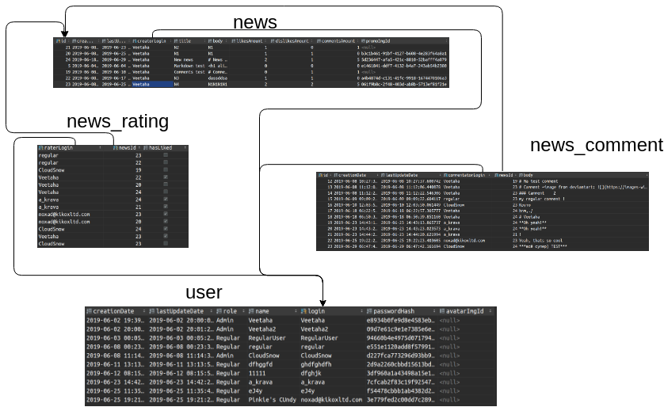

# Lab 1. Getting started with basic PostrgeSQL functionality

## Business field

Website devoted to publishing and discussing computer game news.

## Graphical ER model

## Database relations and tables

## Data description

You can find ojbects fields description [here at live GraphQL playground](https://times-are-changing.herokuapp.com/gql). Beware that server may be idle (since it
is hosted for free) and it needs some time to get up and running.

| Relation | Attribute | Data type |
|----------|-----------|-----------|
| user | `login` - unqiue identifier `creationDate` - date when this account was created `lastUpdateDate` - Date when this account was updated last time `role` - defines user access level `name` - user name to refer to him/her `avatarImgId` - avatar picture url, or null of was not set | String Date Date Enum String  String |
news | `id` - unique identifier `creationDate` - date when this news was created `lastUpdateDate` - date when this news was updated last time `creatorLogin` - login of the user that created this news. `title` - human-readable sentence that laconically describes this news. `body` - news main body markdown text, it may be vulnerable XSS attacks, be sure to sanitize it on the client side after having converted it to HTML. `promoImgId` - id image to display as the.| Int Date Date String String String |
news_comment |`id` - unique identifier `creationDate` - date when this comment was created `lastUpdateDate` - date when this comment was updated `commentatorLogin` - login of the user that cread the comment `newsId` - id of the news that this comment was attached to `body` - text body of the comment| String Date Date String Int String<body> |
news_rating | `raterLogin` - login of the user that rated the news. `newsId` - id of the news that the user rated. `hasLiked` - defines whether the user liked the news or not. | String Int hasLiked |
